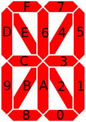

This board is a 16 segment LCD with 10 digits. It reminds 
me to the legendary pocket calculator [HP-41](http://www.hp41.org/Intro.cfm).

Based on the implementation of [PiPicoDisplayEncoder](https://github.com/shabaz123/PiPicoDisplayAndEncoder/tree/main) I created a
library for the display.

Based on the segments used by HP-41 I created a dictionary that 
mapes cheat segment to a bit. 

    #      FEDCBA9876543210
    '0': 0b1010101110110011,

For testing purpose I added a Web Server so you can 
put strings up to 10 charaters from your browser. 

Example can be found [here](https://github.com/dmadison/LED-Segment-ASCII) or use your HP-41 :-)

Example: 

    from dm8ba10.DM8BA10 import DM8BA10
    import time

    def main():
        print('main starts....')
        myLCD = DM8BA10(data_pin=20, wr_pin=21, cs_pin=22)
        myLCD.clear()
        
        myLCD.scrolltext('The quick brown fox jumps over the lazy dog', 0.1)

        for i in range(0, 10):
            myLCD.dp_insert(i)
            time.sleep(0.1)
        myLCD.dp_insert(0) # clear DP

        myLCD.printtext('-->   <--')
        myLCD.rotor(5, 5, 0.2)
        
        myLCD.clear()

    main()